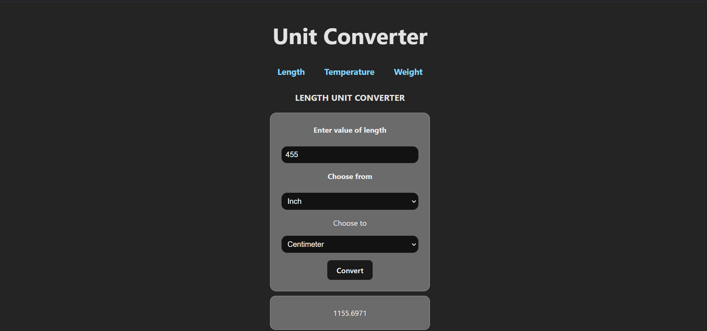
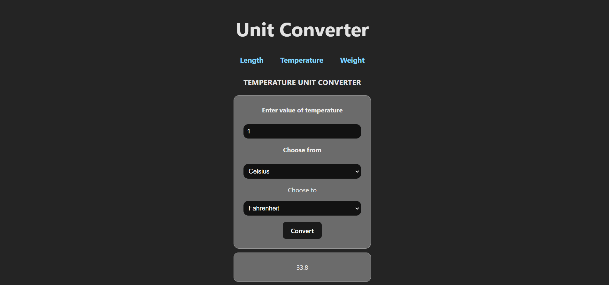

# Unit Converter

This is a practical fullstack project for practicing communication between a REST API and a basic WEB APP, which deals with a unit of measurement converter, in this case the main ones will be length, weight and temperature.

#### `Frontend`

This is responsible for handling data entry, making the corresponding requests to the backend and showing the results to the user.

#### `Backend`

This is responsible for handling the data sent from the web app, performing the corresponding conversions and returning the conversion result.

## Captures of Unit Converter

<div style="display: flex; justify-content: space-between;">
  
  
</div>

## Used Techonologies

### `Frontend`

<p align="left">
  
  
  
  
  
  
</p>

### `Backend`

<p align="left">
  
  
  
  
  
  
</p>

## Local Installation

1. Clone this repository:
   ```bash
   git clone https://github.com/nmmartinezp/Unit-Converter.git
   ```
### `Backend`

Into Backend folder:

1. Install the dependences
  ```bash
   npm install
  ```
2. If necessary configure the cors into the app.js file, this is for the requests from frontend
  ```javascript
    // Open requests from frontend
    app.use(cors({
    origin: "http://localhost:5173" //frontend en Vite
    }));
  ```
3. Configure environment variable file .env to root folder
  ```.env
    SERVER_PORT = # Port -> for example 8181
  ```

### `Frontend`

Into Frontend folder:

1. Install the dependences
  ```bash
   npm install
  ```
2. Configure environment variable file .env to root folder, with routes of api
  ```.env
    VITE_API_URL=http://localhost:SERVERPORT/converter/
    VITE_API_URL_LENGTH=lengthconvert/
    VITE_API_URL_WEIGHT=weightconvert/
    VITE_API_URL_TEMPERATURE=temperatureconvert/
  ```

## Practice Project for

[](https://github.com/nmmartinezp)
